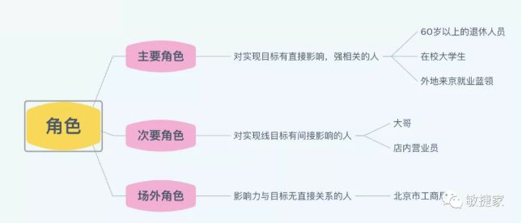

# 影响地图

当一个项目或一个需求给到研发的时候，通常业务最关心的是工期与成本。研发是基于上述要求交付产品的，这实际上是一种契约关系。契约关系的优点在于权责分明，而最大的问题是研发辛辛苦苦生产出来的产品，真的能够创造业务价值，为公司带来收益吗？
研发对于商业结果并没有强烈的直接关系。我相信研发内心是希望有这样的关联关系的，因为研发的成就感不是来自于做完而是来自于做的有价值。
不对的产品做得质量再高、速度再快也是一种浪费。但是业务和研发之间似乎总有一堵看不见的墙，难以逾越。

## 何为影响地图

影响地图是这样一种方法或工具：完全以业务目标为导向，业务+产品+研发在一起共创，每一个碰撞出来的点子都直接和业务结果强相关，并采用探索、低成本试错的方式，通过迭代快速持续开发实现。影响地图的基本模型：（分为WHY-WHO-HOW-WHAT四层级）

影响地图的第1层（WHY）：确立切实可行的商业目标（符合SMART原则）。
影响地图的第2层（WHO）：要分析出对业务目标产生影响的角色。如下图示例。

影响地图的第3层（HOW）：角色实施怎样的行为可能会对目标产生影响。
影响地图的第4层（WHAT）：我们做什么可以促使角色实施对目标产生影响的行为。换句话说，我们做什么能够让角色去实施“HOW”中的行为。

## 影响地图应用实践

影响地图非常的可视化而且目标感很强。右端任何一个细节都会对目标产生影响， 都能够很清晰的找到它与目标的轨迹。在实际应用的场景，能够防止在各种复杂繁多的方案假设和激烈的讨论中不至于偏离方向。

影响地图实践-选址产品工作坊（如下图）：

所有绿色的部分都是可能对目标产生影响的点子（预期交付的功能），如何去实施呢？ 首先，进一步的需求分析不是一次性全部做完的，否则全部需求的（BRD+PRD）的时间太长，时效性较差。此外，在没有经过验证之前，所有绿色的点子都是假设，未必都真的有效，全部做完成本太高。 敏捷教练反复引导，所有绿色的点子是否和业务目标相关联（聚焦价值），在此基础上，团队（业务+产品+研发）通过投票选出最先尝试的TOP3。不是只做TOP3 ，但也未必影响地图上的全部假设都要实现。重要的是以小批次、快速验证的方式持续进行。

“影响地图把交付内容分解成对各个影响有贡献的分支，促使我们思考支持这些影响的快速方法，从而推动真正意义上的迭代交付。”--摘录来自: Gojko Adzic. 《影响地图》

通过影响地图，可高效率、快速的找到能够对目标产生积极影响的需求。如果假设成立就优先开发这些需求，从而更早的创造价值；如果假设不成立就马上调整方向，这样的工作持续、循环进行，直到目标实现。

## 用户故事如何嵌入到影响地图中

标准的用户故事的书写方式是：As a user(who)I want...(how)So that...(why)，因此epic级别的用户故事可以用于编写高层级的影响力地图，而细分的feture以及user story则可以作为地图中的what或者activities、task，作为地图中信息的表述方式，自由的组合在这两个工具（影响地图、用户故事地图）之中。

## 参考资料

> <https://zhuanlan.zhihu.com/p/164552526>
