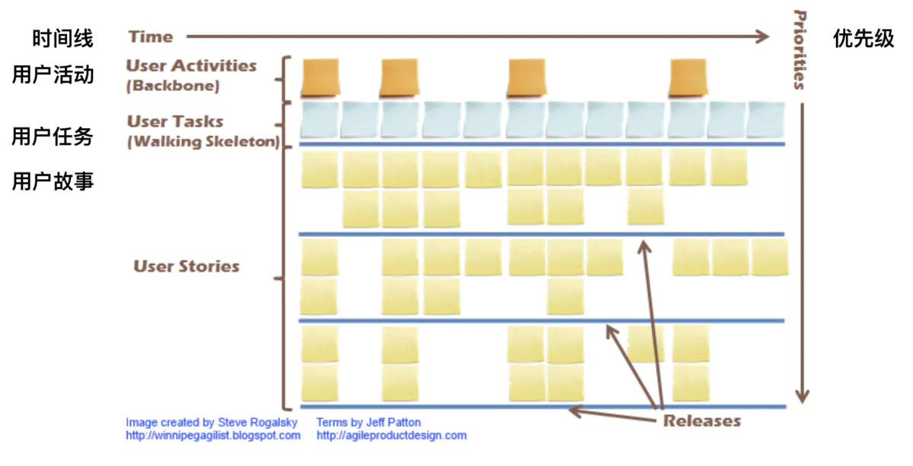
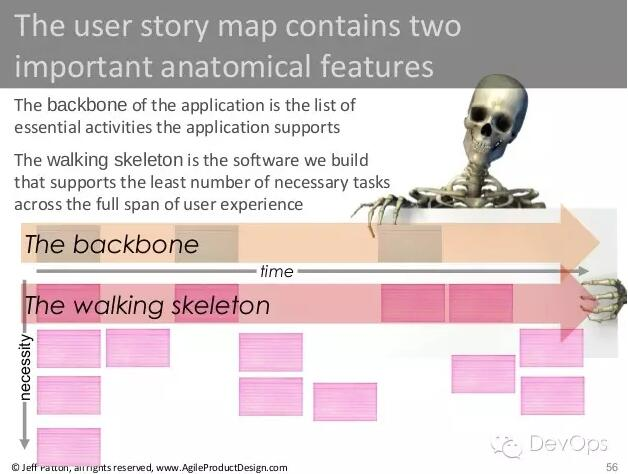
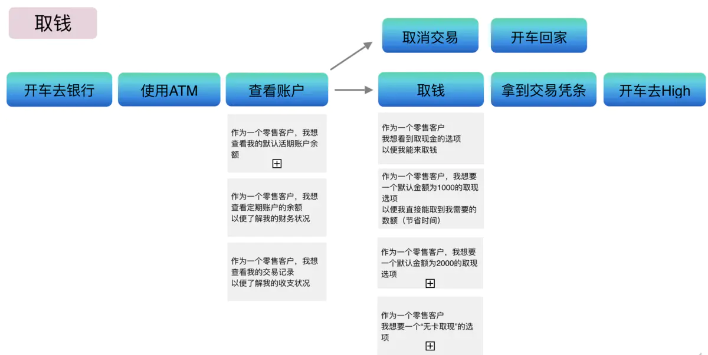
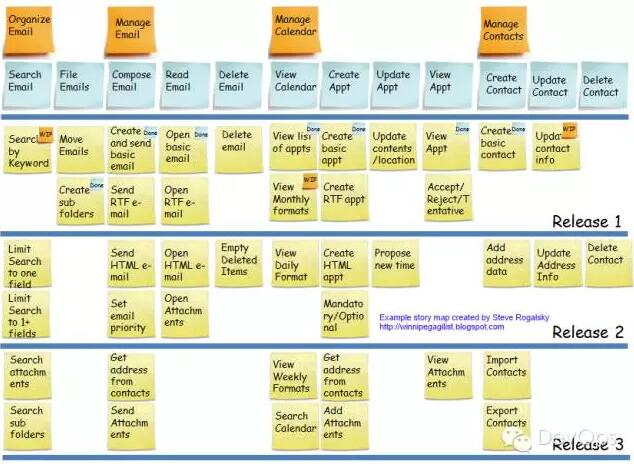
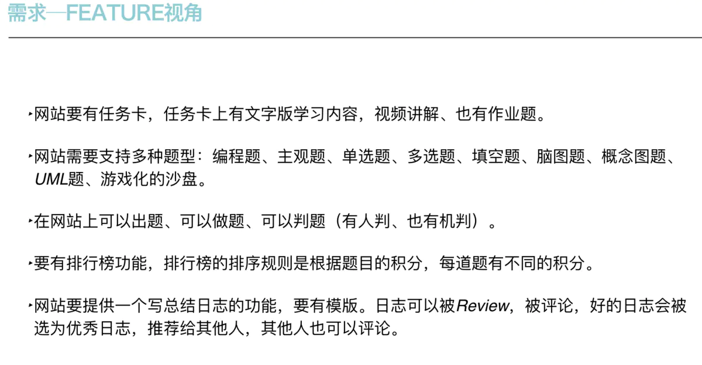
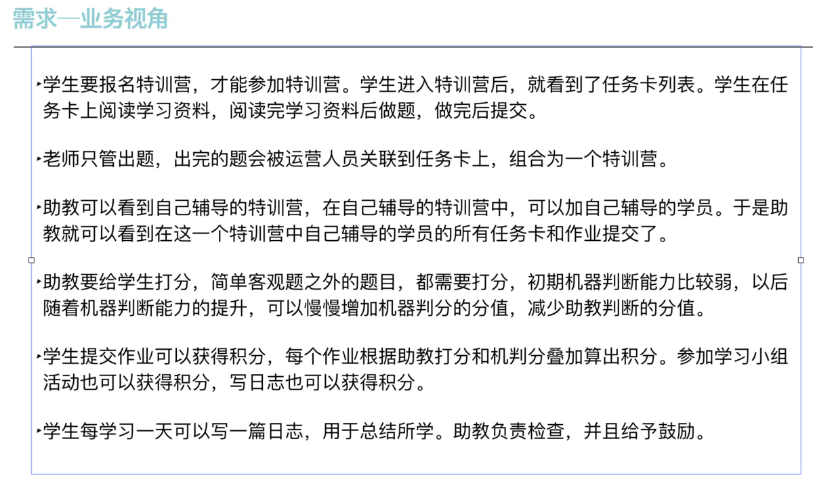
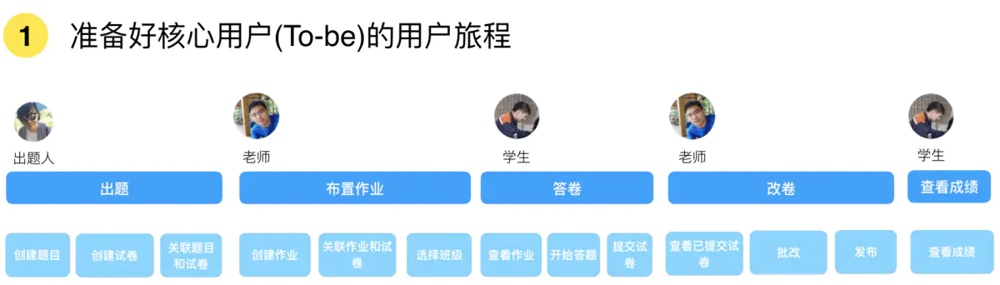
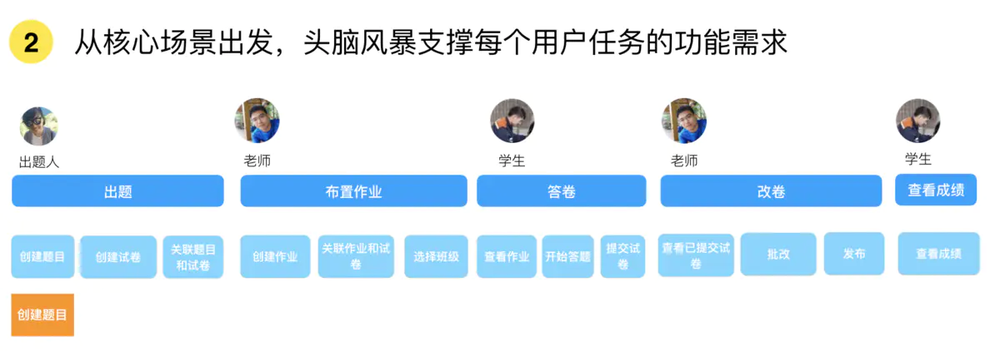
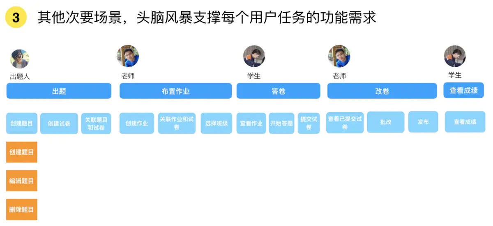
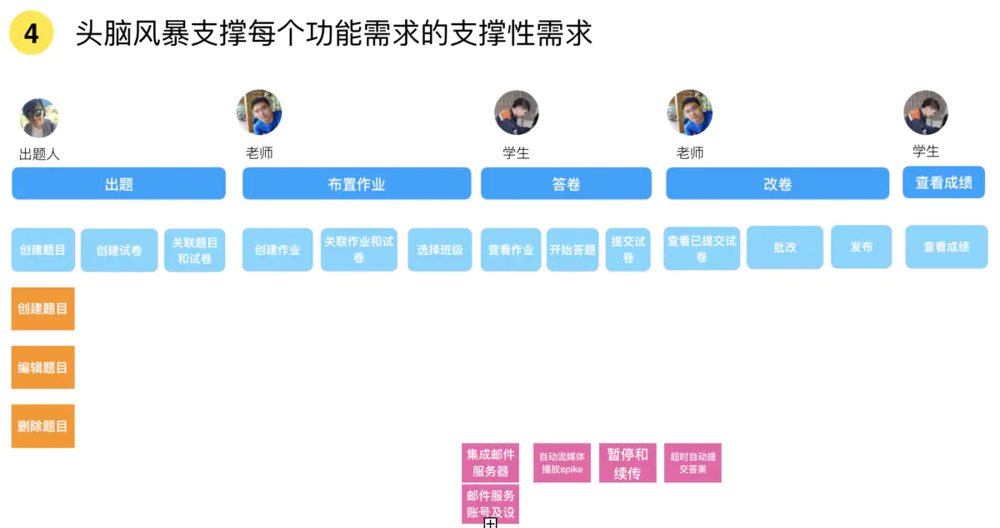

# 用户故事地图

用户故事地图是一种识别需求和梳理需求的工具，同时能帮我们建立需求全景图。

## 解决了什么问题？

随着敏捷软件开发的兴起，它带来了很多积极的影响，比如人们开始认同，大型需求是可以拆分为一个个小的用户故事的。但是需求拆分也带来了相应的负面影响，那就是容易造成只见树木不见森林，丢掉需求全景的理解。用户故事地图就是一种在需求拆分过程中仍然保持需求全景图的一种方法。

## 什么是用户故事地图呢？

它是一个有方向的图表，以时间线为横轴，以优先级为纵轴，然后会涵盖所有的用户故事，表达需求全景。用户故事地图长这样：

### 用户故事地图的简单示例

### 电子邮件系统的用户故事地图示例

## 构建用户故事地图的步骤

### 需求文档

### 翻译为用户视角

### 构建用户故事地图

1. 第一步，梳理应用的骨干业务流程

出题人出题，然后老师布置作业，然后学生答题，然后老师批改，最后学生查看成绩，这就是完整的用户故事，这里我们有不同的用户角色。

1. 第二步，准备好核心用户的用户旅程（user journey）

比如出题人出题时首先需要创建题目，然后创建试卷，然后把题目和试卷关联起来。同样老师布置作业的时候，首先创建作业，然后关联作业和试卷，然后选择布置作业的班级。那么学生答案的过程包括首先查看作业，然后答题，最后提交答案。老师改卷的时候需要首先查看学生提交的试卷，然后批改，最后发布成绩。之后学生就可以查看成绩。

1. 第三步，从核心场景出发，头脑风暴支撑每个用户任务的功能需求

比如针对出题人创建题目的用户任务，其核心场景就是创建题目。

1. 第四步，针对其他次要场景，头脑风暴支撑每个用户任务的功能需求

次要场景比如上图的编辑题目和删除题目，所谓次要场景，指的是即使没有这两个功能系统仍然可用，比如我在第一次上线的时候不包括这两个场景，那么产品仍然可用，用户可以暂且通过后台编辑和删除题目。

1. 第五步，头脑风暴每个功能需求的支撑性需求
紫色的部分就是支撑性需求，相对于功能性需求，也成为非功能性需求。支撑性需求指的是一些技术故事，比如邮件服务器的集成。那么之所以把这些支撑性需求在用户故事地图列出来，是为了tech lead和开发团队可以针对性对这些需求提前进行技术预研或者实现，那么当我们的功能性需求涉及到比如和邮件服务器的集成，就可以直接引用预研结果。保证我们的交付进度。这些支撑性需求往往由Tech lead和BA一起列出来。这也是为什么不仅产品经理和BA（Business Analyst）需要学习用户故事地图，开发与测试人员同样需要的原因，因为有一天你也会成为Tech lead呀！：）

强烈推荐《用户故事地图》一书，作者就是用户故事地图这一工具的提出者，本书从作者亲身经历出发，讲述用户故事地图是如何让需要梳理更加清晰，如何拯救项目于混乱的需求的，同时语言轻快，阅读愉快！

## 参考资料

> <https://www.jianshu.com/p/5e0728602339>.
> <http://www.woshipm.com/pd/270289.html> -- 创建用户故事地图的8个步骤（未复制）
