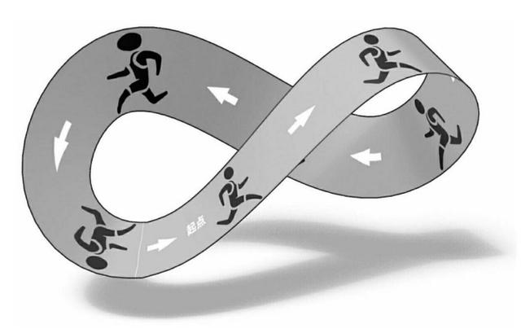
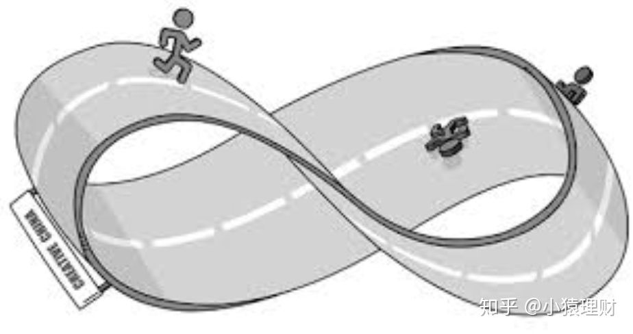

# 莫比乌斯环

莫比乌斯环一般指莫比乌斯带

莫比乌斯带由德国数学家莫比乌斯（Mobius，1790～1868）和约翰·李斯丁于1858年发现。就是把一根纸条扭转180°后，两头再粘接起来做成的纸带圈，具有魔术般的性质。
普通纸带具有两个面（即双侧曲面），一个正面，一个反面，两个面可以涂成不同的颜色；而这样的纸带只有一个面（即单侧曲面），一只小虫可以爬遍整个曲面而不必跨过它的边缘。这种纸带被称为“莫比乌斯带”（也就是说，它的曲面从两个减少到只有一个）。

就像莫比乌斯环一样，小人无论怎么走，永远也走不出几十厘米的莫比乌斯环，人类的知识系统也是类似的，一旦逻辑自洽，就很难找到自己的缺陷。

查理芒格说，我们要使用有大量事实作为依托的大想法，特别是来自数学，物理学等硬学科的思维模型，来验证自己的观点是否正确，为的只是离这个世界的真相更近一步。

因为这样的思维模型，能对问题给出非常有意义的解释。
因为认知缺陷，我们容易被人摆弄，所以我们必须要学会分清楚别人说的是事实，还是观点。

## 参考资料

>[莫比乌斯环的意义是什么？ - 知乎](https://www.zhihu.com/question/23689080)
[莫比乌斯带_百度百科](https://baike.baidu.com/item/%E8%8E%AB%E6%AF%94%E4%B9%8C%E6%96%AF%E5%B8%A6/4457881?fromtitle=%E8%8E%AB%E6%AF%94%E4%B9%8C%E6%96%AF%E7%8E%AF)
[为什么我们能造出莫比乌斯环，却无法造出克莱因瓶？](https://baijiahao.baidu.com/s?id=1667290421098028425&wfr=spider)
