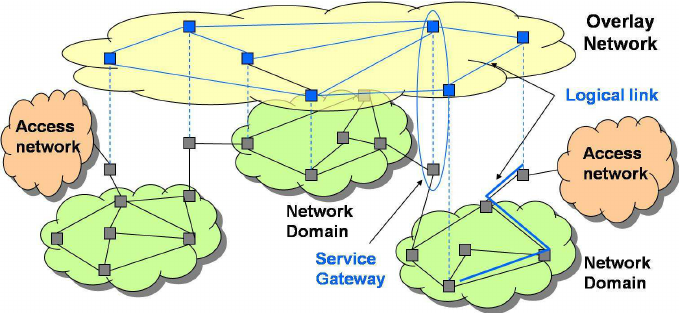
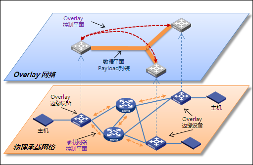

# Overlay 网络

Overlay Network，重叠网络，一种大二层虚拟组网技术。

覆盖网络，是一种SDN（软件定义网络）。是一种使用软件创建网络抽象层的方法，该抽象层可用于在物理网络之上运行多个独立的、离散的虚拟化网络层，通常提供新的应用或安全好处。覆盖网络中的所有节点都通过逻辑或虚拟链路相互连接，并且这些链路中的每一个都对应于底层网络中的一条路径。

覆盖网络协议包括虚拟可扩展局域网（VXLAN）、通用封装的网络虚拟化（NVGRE）、无状态传输隧道（SST）、通用路由封装（GRE）、IP多播、网络虚拟化覆盖层3（NVO3）。覆盖网络的常见示例是分布式系统，例如对等网络和C/S应用程序，因为它们的节点运行在互联网之上。

## Overlay 网络解决了什么问题？

1. 针对虚机迁移范围受到网络架构限制的解决方式
2. 针对虚机规模受网络规格限制的解决方式
3. 针对网络隔离/分离能力限制的解决方式

## 应用场景

1. 云数据中心虚机迁移的场景
2. 些应用的功能组件间通信，需满足在同一个二层域，例如 OpenStack 云平台控制
节点、 计算节点之间通过相应的管理 VLAN 二层互通。
3. 某些运营商在提供机架、 服务器托管等业务时， 存在需要将不同物理机房机架上的
剩余资源作为一个整体出租给用户， 此时需要实现跨物理机房的二层互通。
4. 某些关键业务出于可靠性的考虑， 需要承载业务的服务器/虚拟机的 HA 方案跨越物
理机架甚至物理机房， 此时也需要一个大二层网络环境。

云数据中心时代， 用户对数据中心的诉求不仅仅满足于高速的转发、 高可靠的业务保障， 还追求计算、 存储、 网络资源效率的最大化利用， 能够随业务而动态调整，大二层的网络环境， 则是这种数据中心资源动态调整的情况下， 业务不受影响的基础；而网络虚拟化， 则是实现大二层以及网络敏捷发放的重要技术。

## Underlay Network

底层网络，是建立覆盖网络的物理基础设施。它是负责跨网络传送数据包的底层网络。在数据中心环境中，物理底层网络的作用是提供从任何物理设备（服务器、存储设备、路由器或交换机）到任何其他物理设备的IP连接。

## Overlay Network 与 Underlay Network 的区别

| 领域 | UNDERLAY NETWORK | OVERLAY NETWORK |
| :--- | :--- | :--- |
| 描述 | 底层网络，是物理基础设置 | 覆盖网络，是一种虚拟网络，基于底层网络 |
| 数据传输 | 通过网络设备如交换机路由器传输数据包 | 在覆盖网络节点之间通过虚拟链路传输数据包 |
| 扩展性 | 扩展性差 | 扩展性好，可以快速的增加功能。 |
| 包封装和开销 | 发生于网络3层和4层 | 需要跨源和目标封装数据包，因此会产生额外的开销。 |
| 多路径转发 | 开销和复杂度高 | 通过虚拟网络实现 |
| 管理多租户 | 基于NAT或VRF的隔离在大型网络中是个大的挑战 | 管理多个租户之间重叠ip地址的能力 |

## 参考资料

> [什么是网络overlay技术,为什么需要(江琳莉)](https://www.doc88.com/p-7095099195462.html)
[Overlay network_weixin_30437481的博客-CSDN博客](https://blog.csdn.net/weixin_30437481/article/details/95714888)
