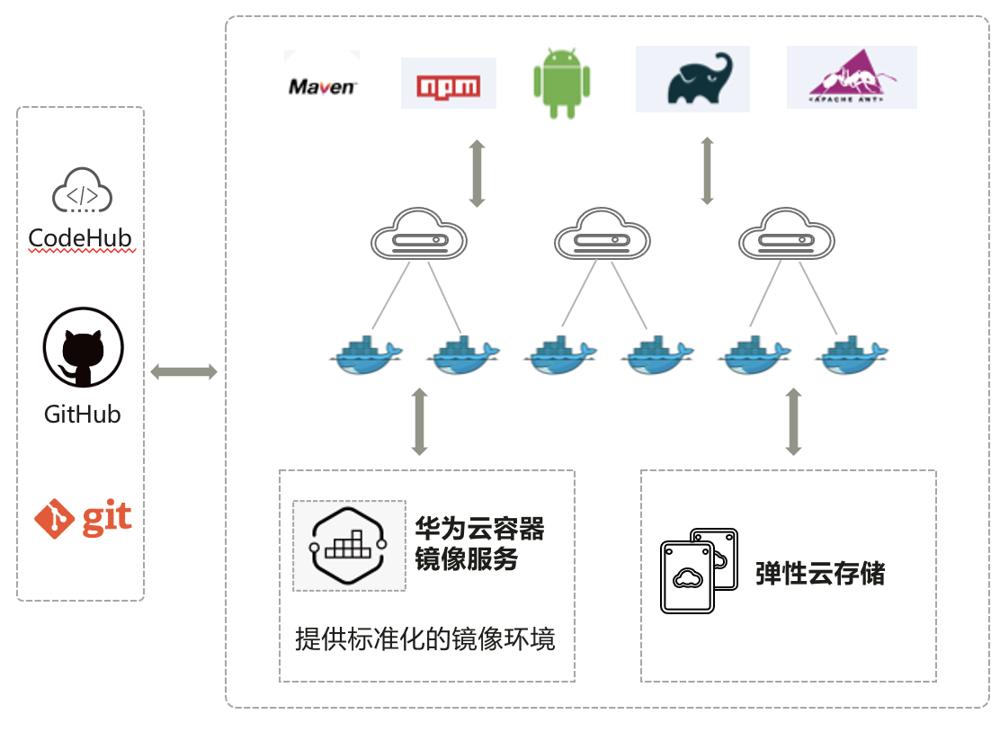

# 编译构建（CloudBuild）

编译构建服务：极简、安全、高效、可信
提供配置即代码的开箱即用服务：统一构建管理，彻底解决构建工具多、老旧、构建过程复杂的问题
提供安全可信的构建服务：实现构建环境可追溯、构建工具链优选等

## 吹的牛

1. 丰富的构建语言和框架
    支持10+种语言，20+种框架的可信构建、6种语言的鲲鹏构建
2. 极速编译构建-10倍构建加速
    构建环境版本化，支持构建可重复，可追溯
    基于监控、弹性和自动化部署的AI智能化解决方案，提供高可靠，高可用的构建服务
    10倍构建加速：全局共享缓存、项目内精准增量构建、并行构建等
    提供容器化极速构建能力，资源利用率 80%
3. 安全可信的构建系统
    构建工程标准化设计和管理，提升构建工程质量
    对开源构建包的统一管理，优选安全稳定版本
    构建环境封闭，自动化安装，保证构建环境可信
