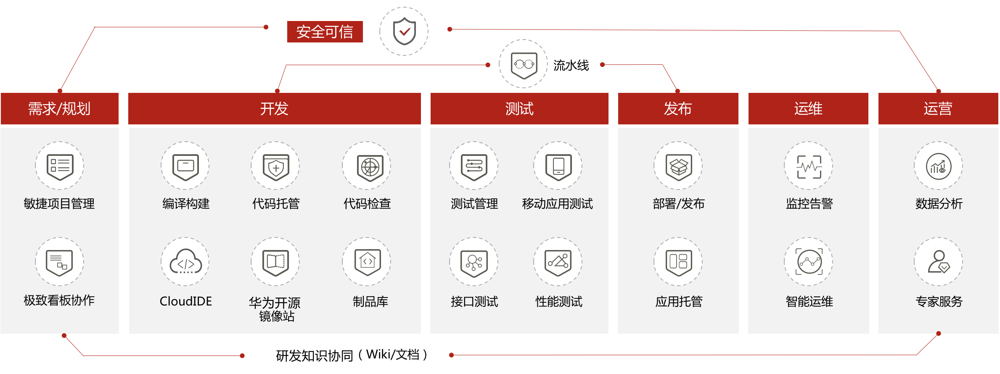
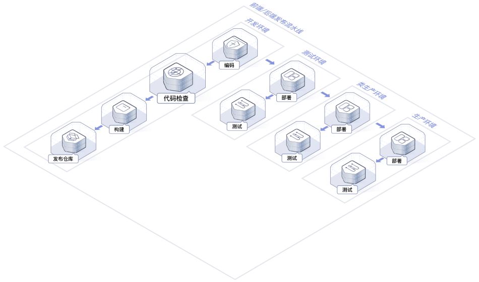
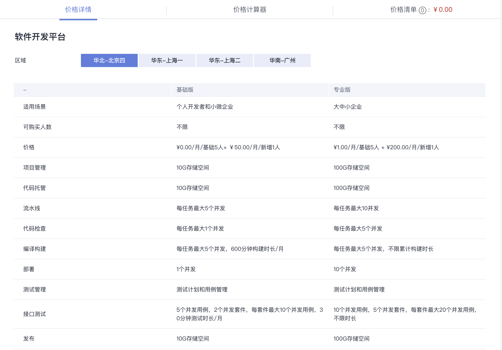

# 软件开发平台

DevCloud基础版、专业版于2020年10月推出。

1. 影响力：
    IDC：2019年 中国DevOps云服务领导者
    Forrest Wave：基础设施和开发平台领导者
    深度参与行业DevOps标准制定
    CDF创始成员：Linux基金会下持续交付基金会
2. 竞争力：
    全流程：业界首家打通研发态DevCloud、运行态ServiceStage、运维态AOM，
    支持主流编程语言和技术栈：20+主流编程语言、开发框架和运行环境，应用无缝迁移上云
    安全可信：安全测试、可信构建、代码安全、资产安全，5+安全标准，2000+专项规则，10000+检查标准

## devops流水线

## 主要功能

1. [ProjectMan（敏捷项目管理，极致看板协作，WIki，文档）](ProjectMan.md)
2. [CodeHub(代码托管)](CodeHub.md)
3. [CodeCheck(代码检查)](CodeCheck.md)
4. [CloudBuild(编译构建)](CloudBuild.md)
5. [CloudIDE](CloudIDE.md)
6. [Mirrors(华为开源镜像站)](Mirrors.md)
7. [CloudRelease(制品库)](CloudRelease.md)
8. [CloudTest(测试管理，移动应用测试，接口测试，性能测试)](CloudTest.md)
9. [CloudDeploy(部署服务)](CloudDeploy.md)
10. [CloudPipeline(流水线)](CloudPipeline.md)
11. 应用管理与运维平台-ServiceStage
12. 应用运维管理-AOM
13. 应用性能管理-APM
14. 弹性云服务器ECS（Elastic Cloud Server）
15. 云容器引擎CCE（Cloud Container Engine）

## 价格详情

>[官网价格详情+价格计算器](https://www.huaweicloud.com/pricing.html?tab=detail#/devcloud)

