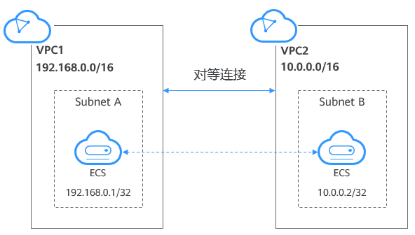

# VPC

虚拟私有云（Virtual Private Cloud，以下简称VPC），为云服务器、云容器、云数据库等资源构建隔离的、用户自主配置和管理的虚拟网络环境，提升用户云上资源的安全性，简化用户的网络部署。

您可以在VPC中定义安全组、VPN、IP地址段、带宽等网络特性。用户可以通过VPC方便地管理、配置内部网络，进行安全、快捷的网络变更。同时，用户可以自定义安全组内与组间弹性云服务器的访问规则，加强弹性云服务器的安全保护。

华为云提供了管理虚拟私有云的功能：创建虚拟私有云、修改虚拟私有云基本信息、为虚拟私有云添加扩展网段、删除虚拟私有云扩展网段、删除虚拟私有云和导出虚拟私有云列表。

## 对等连接

对等连接是指两个VPC之间的网络连接。您可以使用私有IP地址在两个VPC之间进行通信，就像两个VPC在同一个网络中一样。同一区域内，您可以在自己的VPC之间创建对等连接，也可以在自己的VPC与其他帐户的VPC之间创建对等连接。不同区域间的VPC之间不能创建[对等连接](https://support.huaweicloud.com/productdesc-vpc/vpc_Concepts_0011.html)。

## 参考文档

> [功能总览_虚拟私有云 VPC_华为云](https://support.huaweicloud.com/function-vpc/index.html)