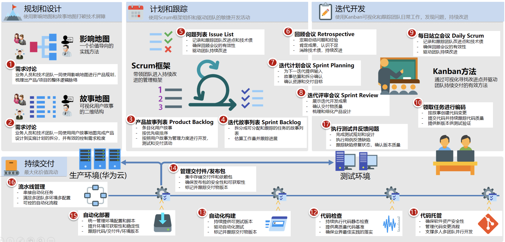

# HE2E DevOps专家咨询服务，融合精益-敏捷-DevOps方法论和实践

## DevSecOps实践的建议

1. 安全可信：每个人的责任
    开发、运维、运营、安全| 合规服务化 | 全生命周期
1. 架构解耦：基础条件
    独立交付 | 低依赖 | 范围可控
1. 自动化和知识协同：效率与持续改进
    Built-in | 可度量 | 知识共享
1. 全功能团队：自治，对商业和用户负责
    充分授权| 聚焦价值 | 用户反馈
1. 生产环境极其重要，严守红线
    不允许已知漏洞流入 | 红线门禁
1. 关注开源/第三方，等同自研
    开源漏洞管理 | 第三方入库扫描 | 反馈社区
