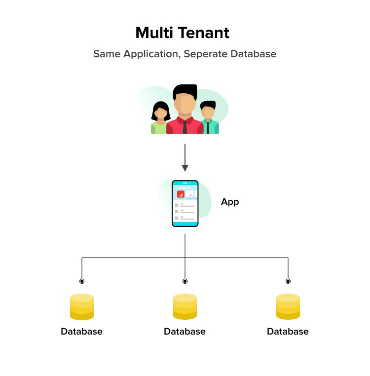
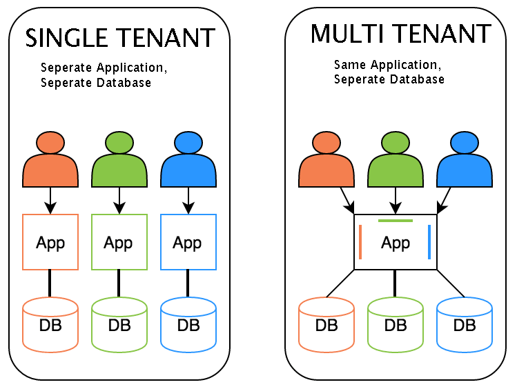
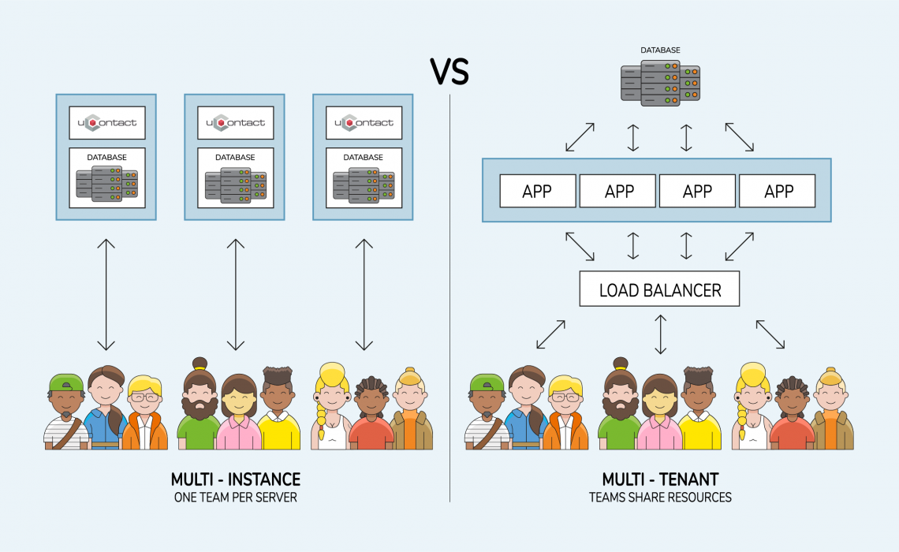
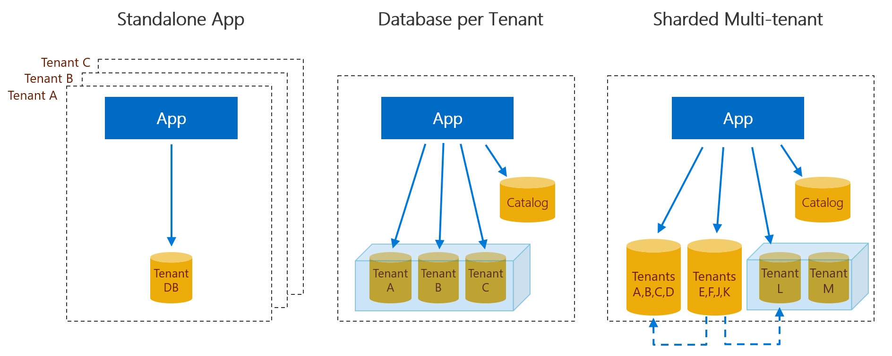
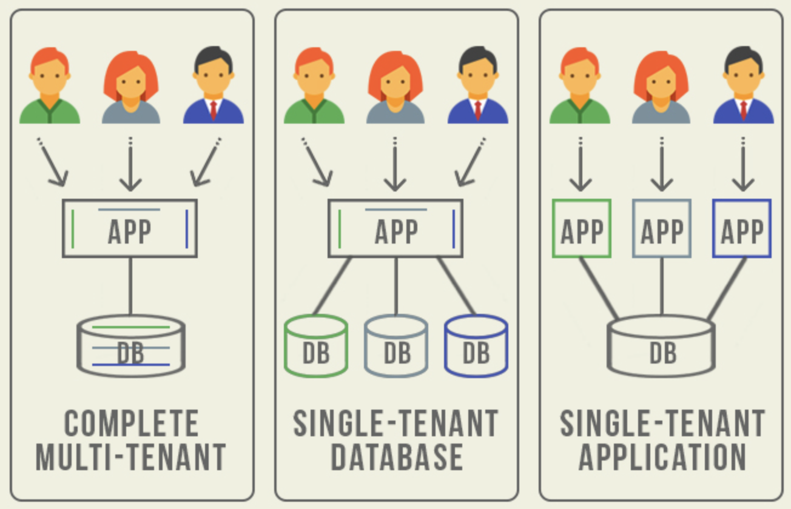

# 多租户

多租户技术或称**多重租赁**技术，简称SaaS，是一种软件架构技术，是实现如何在多用户环境下（此处的多用户一般是面向企业用户）共用相同的系统或程序组件，并且可确保各用户间数据的隔离性。
简单讲：在一台服务器上运行单个应用实例，它为多个租户（客户）提供服务。
从定义中我们可以理解：多租户是一种架构，目的是为了让多用户环境下使用同一套程序，且保证用户间数据隔离。

## 与单租户的区别

单租户是为每个客户单独创建各自的软件应用和支撑环境。
单租户SaaS被广泛应用在客户需要支持定制化的应用场合，而这种定制或者是因为地域，抑或是他们需要更高的安全控制。
通过单租户的模式，每个客户都有一份分别放在独立的服务器上的数据库和操作系统，或者使用强的安全措施进行隔离的虚拟网络环境中。

## 多租户数据隔离的三种方案

1. 独立数据库
    这是第一种方案，即一个租户一个数据库，这种方案的用户数据隔离级别最高，安全性最好，但成本较高。
    优点：为不同的租户提供独立的数据库，有助于简化数据模型的扩展设计，满足不同租户的独特需求；如果出现故障，恢复数据比较简单。
    缺点： 增多了数据库的安装数量，随之带来维护成本和购置成本的增加。

2. 共享数据库，独立 Schema
    即多个或所有租户共享Database，但是每个租户一个Schema（也可叫做一个user）。底层库比如是：DB2、ORACLE等，一个数据库下可以有多个SCHEMA
    优点： 为安全性要求较高的租户提供了一定程度的逻辑数据隔离，并不是完全隔离；每个数据库可支持更多的租户数量。
    缺点： 如果出现故障，数据恢复比较困难，因为恢复数据库将牵涉到其他租户的数据； 如果需要跨租户统计数据，存在一定困难。

3. 共享数据库，共享 Schema，共享数据表
    即租户共享同一个Database、同一个Schema，但在表中增加TenantID多租户的数据字段。这是共享程度最高、隔离级别最低的模式。
    即每插入一条数据时都需要有一个客户的标识。这样才能在同一张表中区分出不同客户的数据。
    优点：三种方案比较，第三种方案的维护和购置成本最低，允许每个数据库支持的租户数量最多。
    缺点： 隔离级别最低，安全性最低，需要在设计开发时加大对安全的开发量； 数据备份和恢复最困难，需要逐表逐条备份和还原。如果希望以最少的服务器为最多的租户提供服务，并且租户接受牺牲隔离级别换取降低成本，这种方案最适合。

## 问题

1. 每个计费主体算一个租户？

## 参考资料

> [对多租户的理解](https://zhuanlan.zhihu.com/p/174217549)
> [一篇文章读懂SaaS多租户和单租户的分别](https://baijiahao.baidu.com/s?id=1654779864874148599)
> [多租户模型_田攀的日志-CSDN博客_多租户](https://blog.csdn.net/pan_tian/article/details/88202074)
> [什么是多租户？](https://www.redhat.com/zh/topics/cloud-computing/what-is-multitenancy)
> [谈谈对多租户系统的简要理解 | 人人都是产品经理](http://www.woshipm.com/pd/4353196.html)
> [设计多租户架构 &nbsp;|&nbsp; 云架构中心 &nbsp;|&nbsp; Google Cloud](https://cloud.google.com/architecture/designing-multi-tenant-architectures?hl=zh-cn)
> [多租户与多用户的区别？ - 知乎](https://www.zhihu.com/question/20162489)