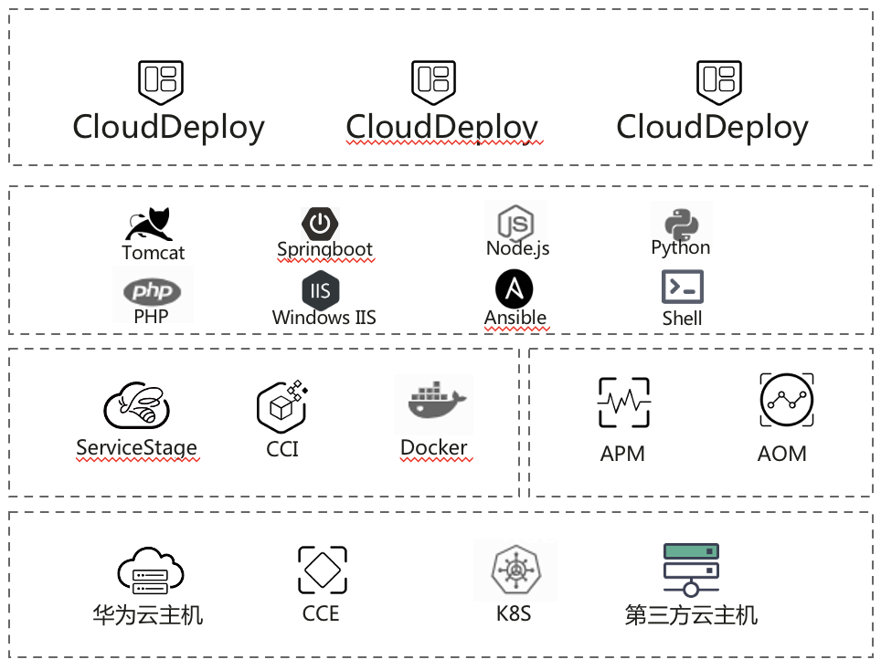

# 部署(CloudDeploy)

部署服务：多形态，多技术栈，专业的应用部署
丰富的部署模板：内置如SpringCloud/Tomcat/自定义，解决部署任务复杂和串联困难，用户只需填写固定参数
丰富的原子操作：自定义模板提供原子操作，客户可以完成任意部署任务，模板可保存复用，解决个性化部署需求

部署（CloudDeploy）提供可视化、一键式部署服务，支持部署到虚拟机或者容器，提供Tomcat、SpringBoot等模板或者自由组装编排原子步骤进行部署，支持并行部署和流水线无缝集成，实现部署环境标准化和部署过程自动化。

## 吹的牛

1. 多形态：可部署到物理机、虚机、容器
    支持将应用部署虚拟机，容器
    支持主机有Agent或无Agent模式提供应用监控数据
    支持以代理机的方式进行部署
    支持部署到华为云ServiceStage平台进行应用管理
    纳管华为云CCE以及客户的私有K8S的集群
1. 多技术栈：可支持多种技术栈应用的部署
    支持Tomcat，Springboot，Node.js等多种技术栈
    提供通用模板+自定义模板，提供25+原子步骤组装成部署任务
    支持Ansible、shell等强大的通用能力
1. 多集成：流水线，ServiceStage应用托管，AOM运维无缝集成
    在流水线能关联部署任务
    可以读取流水线传递的参数，选取构建服务的产物进行部署
    应用部署时可以选择开启APM/AOM服务，方便在DevCloud上运维管理应用
1. 专业的部署能力
    支持部署回滚能力
    支持多部署任务并行执行
    支持对人员权限进行控制，保证部署的环境安全
    部署任务实时显示日志，迅速定位部署问题

## 参考资料

> [部署 CloudDeploy_华为云](https://support.huaweicloud.com/clouddeploy/index.html)