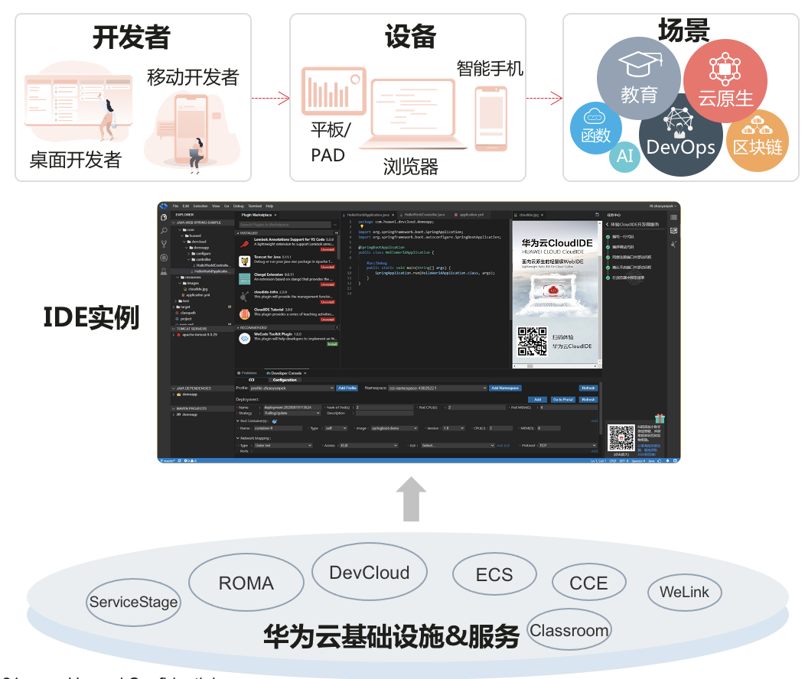

# CloudIDE

华为云CloudIDE是云开发环境服务，开发者通过浏览器访问即可极速获取云端开发环境，支持编码、调试、运行、预览，还可访问代码仓库和执行命令行，同时支持丰富的插件扩展。
CloudIDE服务：云端IDE，开箱即用的编码，调测，完备的生态支持
使用CloudIDE服务，按需获取云端集成开发环境，开箱即用的编码、调试、运行、发布、部署等能力，研发业务过程不下云；
扩展CloudIDE服务，利用开放API接口、开源插件框架、插件市场和代码工程模板，轻松扩展和适配多样场景，实现业务增值；

## 吹的牛

1. 容易获取的优质体验开发环境
    按需获取：一键极速（30秒）获取云端的IDE开发环境；
    主流语言：支持Java/Python/Go/NodeJS/C/C++等主流语言；
    功能齐备：支持语法高亮、编码调试、运行预览等常用操作；
    模板丰富：提供基于工程模板创建项目代码，不必从零开始；
1. 适配多种开发场景
    一键上云：开发的微服务可以一键部署到华为云；
    移动轻应用：支持开发基于WeLink的移动轻应用；
    代码检视：集成于代码托管服务，方便实现快速代码检视；
    可选规格：根据研发场景不同可以选定不同的计算和存储配置；
1. 具备完备的生态能力
    插件市场：插件市场的丰富插件可以满足不同业务需要；
    开发接口：通过开放API集成于解决方案实现业务增值；
    开源插件框架：企业可根据开源插件框架构建和发布自有业务插件；
    插件工具：可基于CloudIDE提供的环境和工具开发CloudIDE插件；
