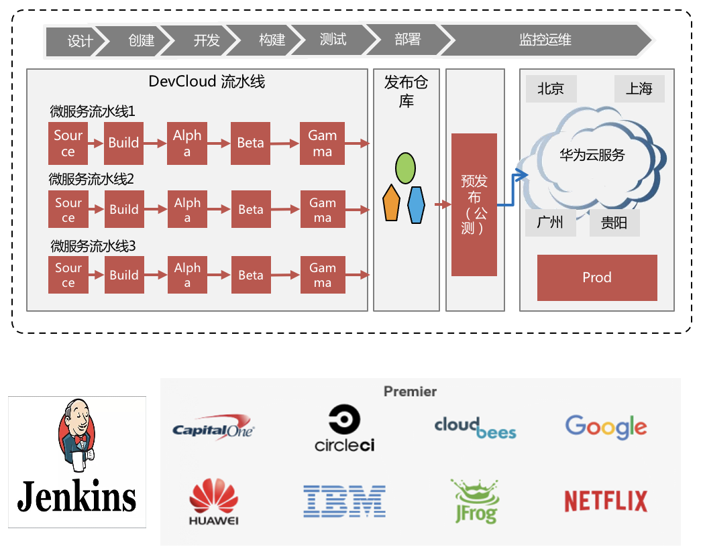

# 流水线（CloudPipeline）

流水线（CloudPipeline）提供可视化、可定制的持续交付流水线服务，实现缩短交付周期和提升交付质量的效果。

流水线服务：灵活编排调度，内置质量门禁，可高质量快速交付应用
微服务：适用于大型系统微服务拆分后，大量微服务应用的交付场景，流水线可支撑微服务和微服务之间的独立、跨地域交付协同演进；
质量可靠：大规模团队交付的代码质量通过流水线内置前置的自动化质量手段得到有效管控，保障产品交付稳步迭代

## 吹的牛

1. 分层分级
    分层分级流水线，可通过子流水线-stage-job实现多级灵活串并行调度
1. 编排调度
    编排调度编译构建、代码检查、部署等多类型任务，流水线式交付，可支持多分支编排、输入输出串联编排等复杂场景
1. 质量管控
    设置自动化质量门禁，人工卡点，等待时间等控制任务，可自定义质量门禁
1. 生态开放
    Jenkins CDF基金会中国区唯一会员，持续贡献领先的CI/CD能力
    支持Jenkins、GitHub、码云等主流生态
    提供丰富的API&SDK
