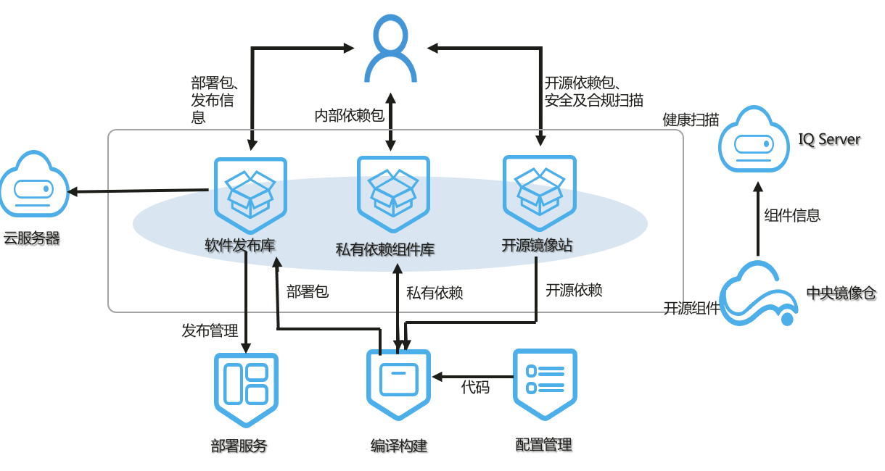

# 发布（CloudRelease)

发布和制品库服务：提供安全、可靠的软件制品管理
软件制品库是用于管理软件开发过程产生的“软件包”，软件制品库是连接持续集成和持续交付的重要环节
软件制品库同时还需要软件包的发布评审、追溯和安全控制等操作

## 吹的牛

1. 多格式制品私有库
    支持Maven、Docker等私有组件管理
    支持支持编译构建一键发布私有组件
    私有组件变化追踪并及时知会
1. 全生命周期支持
    从源码到二进制自动化流水线
    一键引用嵌入已有工程
    二进制版本管理
1. 跨团队、多地域分发
    团队间开发依赖
    跨地域组件共享
1. 企业级高可靠
    SFS Tubor自动数据备份
    双AZ容灾、ACL访问权限控制
1. 便捷使用
    开箱即用、无缝对接CloudIDE、云上构建
    本地一键批量迁移
