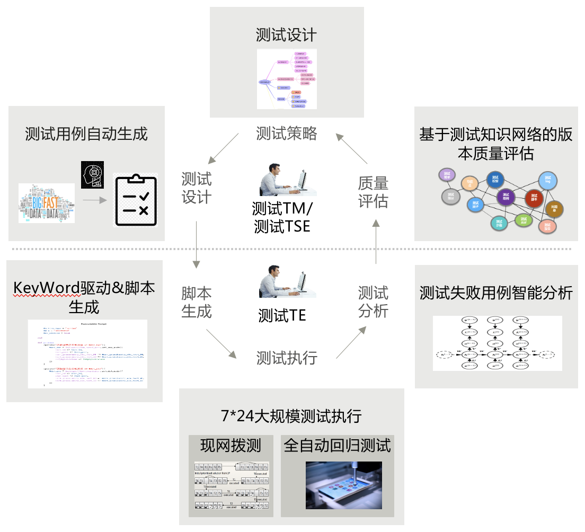

# 云测（CloudTest）

云测服务：国内领先的大规模、高并发、高频自动化测试工厂

## 吹的牛

1. 大规模、高并发、高频自动化测试
   性能测试：支持百万级TPS，支持单机高并发压测
   API测试：支持REST、Swagger等多种接口；支持一键提取测试关键字，最大化复用测试用例
   云测服务：支持Python，接口测试自动化，打造7x24小时的自动化测试工厂
   移动测试：支持2万部真机的兼容性和功能测试
2. 基于敏捷测试理念的持续测试与反馈
   一站式全生命周期管理测试活动
   需求驱动测试：需求、用例、缺陷双向追溯，专门的追溯视图
   CI/CD流水线执行自动化测试，快速反馈，自定义测试门禁
   支持测试数据和逻辑分离，一套测试资产在多环境复用
