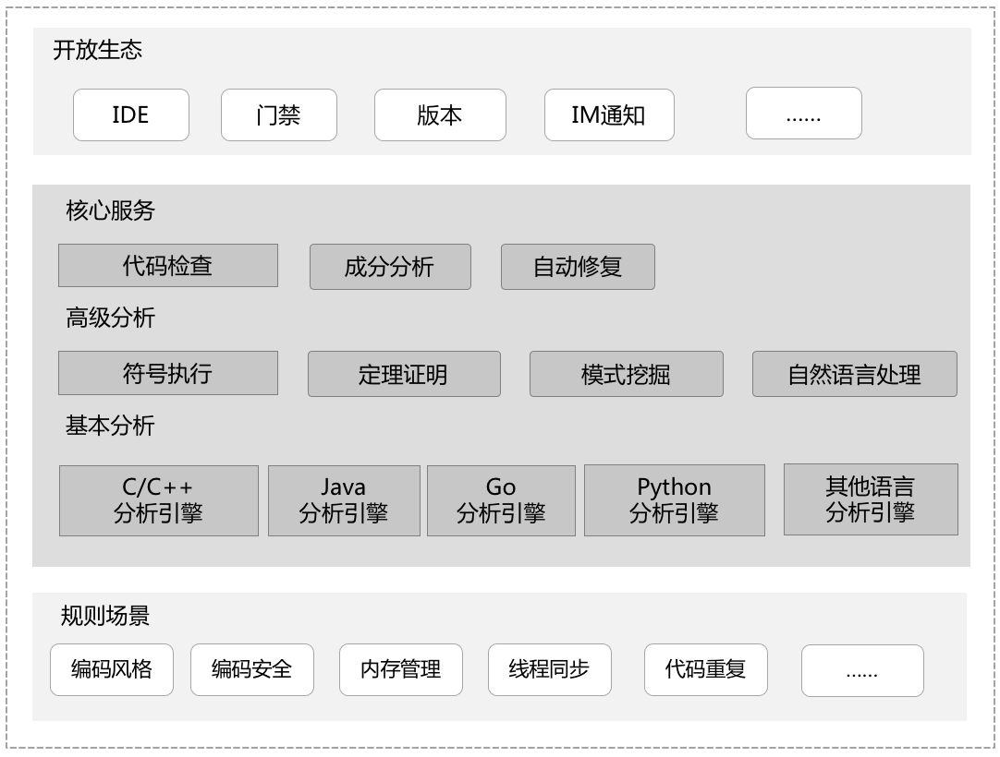

# CodeCheck 代码检查

代码检查服务：自主研发的代码静态检查与修复能力，智能代码分析
以数据驱动为基础，提供开箱即用、开发流程融合、高扩展的自主代码检查平台
支撑开发及时准确地识别代码中潜在的问题：通过智能化技术，提供缺陷自动修复能力，帮助开发快速修复代码缺陷

## 吹的牛

1. 自主研发
   自主研发基于语法树、CFG的跨过程检查的代码检查引擎，支持C/C++、Java、Python、Go、C#、JavaScript、CSS、HTML、TypeScript、PHP 10种语言的代码检查
2. 沉淀华为30年研发经验的高质量代码检查规则集
   3000+代码检查规则，编程风格/编码安全/内存管理/输入校验/不安全函数/线程同步、代码重复率等20+代码检查规则场景
   兼容CWE/OWASP TOP 10/SANS TOP 25/MISRA/CERT等5+种安全编码标准
3. 自动化辅助缺陷修复
   提供智能修复建议：代码静态检查缺陷智能重构技术，自动/辅助开发修复软件缺陷，提升问题修复效率。
   29类Java编程规范缺陷修复能力；87类C/C++编程规范缺陷修复能力；4类Go代码自动修复能力。

## 最佳实践

1. 自定义检查规则集：`设置/规则集`
2. 忽略文件：按需配置，`设置/忽略文件`
3. 可以在流水线中集成代码检查任务
4. 设置质量门禁：`设置/质量门禁`
5. 持续集成：`设置/执行计划/持续集成`，支持：代码提交时执行，自动合并检查运行中的新请求。
6. 开启代码评审（MR）的自动化检查：`设置/集成与服务`，打开`MR检查状态`。
7. 检查结果通知：`设置/集成与服务`，使用钉钉或者企业微信通知用户（群），或使用`设置/通知管理`开启邮件通知。
8. 多语言混合检查：代码仓库`设置/仓库信息/语言`，可以选择多种语言。
9. 在`代码问题`页面，可以在具体的问题上直接创建问题单，指定责任人。
10. 可以将代码放在自建的仓库中：CodeCheck支持其他的源码源，比如github，码云，通用Git。
11. 启用编译检查：`设置/规则集/检查参数`中设置java的编译工具，编译命令等。

## 问题

1. 检查历史记录在哪里看？`设置/执行历史`，也只能看执行时间，结果什么的都看不了。
2. 只支持10种语言（C++、Java、Python、Go、C#、JavaScript、CSS、HTML、TypeScript、PHP）
3. 自建了基于华为Python规则集的规则集，无法修改“建议1.7 一行长度小于80个字符，与Python标准库看齐”的阈值。
4. 华为规则集对于多种问题的级别设置不合理，比如严重的“建议1.7 一行长度小于80个字符，与Python标准库看齐”，“规则2.5 文档字符串多于一行时，末尾的"""要自成一行”
5. 不能自定义规则
6. Java的规则集比较多，但是该用哪个呢？总不能为不同规则集创建多个任务吧。
7. 怀疑Python的圈复杂度检测方法有问题，有些文件居然3、4百的圈复杂度（实际每个方法并不复杂）。
8. 既然这么不准确，我该怎么让检查通过呢？总不能修改质量门禁吧！还是说将某些规则去掉？
9. `设置/集成与服务` SecGuard怎么用？用不了啊！
10. 不能选择多个规则集！！！
11. 多分支检查--需要切换分支手动执行，不能自动化？
