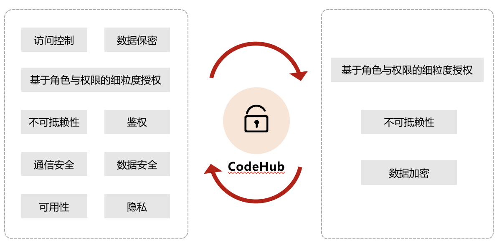
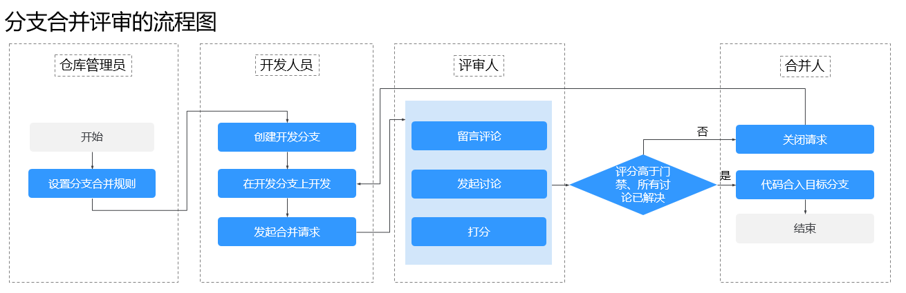
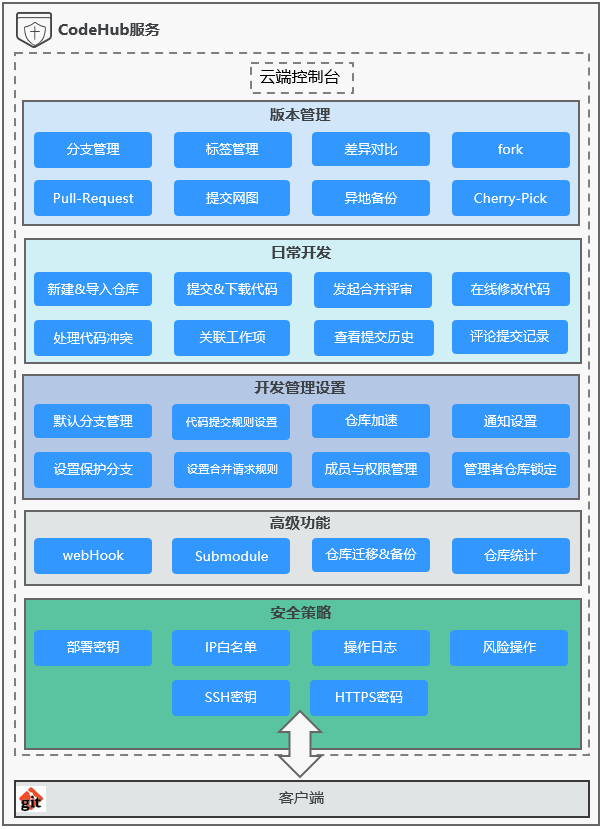

# CodeHub 代码托管

自研代码托管服务，并对Git内核进行大量扩展和加固，松耦合架构，解决大规模开发活动下的性能以及容量问题。

基于华为多年的安全可信技术积累，构筑坚固的防护链，确保核心代码安全，可信，防篡改。

## 吹的牛

1. 安全可信
    基于IPDRR（识别、保护、检测、响应、恢复）核心框架全方位构筑代码安全防护网
    CleanCode策略、E2E追溯能力，满足代码可信
2. 大规模并发下载
    单个大仓库大规模下载，通过热点大仓缓存加速
    全量源码构建，多仓协同超大规模下载，多副本下载加速技术
3. 多维度保证代码安全
   代码是软件企业的核心资产和数字化大厦的“沙粒”，DevCloud CodeHub服务除了Git代码仓通用的SSH密钥，还增加了企业级的多维度安全特性。

   - 访问安全控制：提供保护分支功能，提供IP白名单设置，能够保证特定权限+特定IP才能访问代码仓库
   - 提供代码仓库操作日志：详细记录who，when，what，how的信息，用于审计和追溯
   - 提供了部署密钥的管理：SSH密钥对应所有仓库的读写权限，部署密钥对应个别仓库的只读权限
   - 项目成员和角色的权限控制功能：只有仓库管理员和仓库所有者能删除仓库，开发者角色能读写，浏览者只能读
   - 代码误操作与恢复：如果客户是删的代码库的某个版本，历史版本还有，如果删除的是整个库，不超过时间限期不会物理删除
   - 异地备份：支持将仓库备份到华为云的其它区域。支持将仓库备份到您本地计算机。
   - 锁定仓库：为防止任何人破坏即将发布版本的代码仓库，管理员可以锁定仓库，在锁定仓库后，任何人都无法向任何分支提交代码

## 最佳实践

1. 开通2个区域的DevCloud服务，1主1备。
2. 代码仓库`设置/异地备份`，在备份区域创建仓库并设置定时同步。
3. 保护分支设置：`设置/保护分支管理/新建保护分支`，建议 `管理者权限（不能提交、能合并），开发者权限（不能提交、能合并）`。
4. 设置IP白名单：`租户级IP白名单`或仓库级`设置/IP白名单/新建IP白名单`，支持IPv4和IPv6。IPv4三种类别：单个IP（公司公网出口IP），IP范围（比如：117.78.39.0 - 117.78.39.255），CIDR格式（无类别域间路由，比如222.80.18.18/25），IPv6支持单个IP和IP范围。
5. 操作日志：`设置/操作日志`
6. 部署密钥：`设置/部署密钥`，用于持续集成场景，允许通过SSH协议以只读的方式克隆仓库。
7. 按需`锁定仓库`: `设置/锁定仓库`，锁定仓库后，任何人都无法向任何分支提交代码（包括管理员本人）。
8. 子模块：`设置/子模块设置`，将公共仓库作为子目录包含到您的仓库中，并能够双向更新该公共仓库的代码；借助子模块您能将公共仓库隔离、复用，能随时拉取最新代码以及对它提交修复，能大大提高您的团队效率。示例：某个工作中的项目A需要包含并使用项目B（第三方库，或者你独立开发的，用于多个父项目的库），如果想要把它们当做两个独立的项目，同时又想在项目A中使用项目B，可以使用Git的子模块功能。子模块允许您将一个Git仓库作为另一个Git仓库的子目录。它能让你将另一个仓库克隆到自己的项目中，同时还保持提交的独立。[文档](https://support.huaweicloud.com/usermanual-codehub/codehub_ug_1001.html)
9. 关联工作项：`git commit -m "fix #123 解决ie浏览器显示问题"`
10. 代码评审-分支合并评审流程 

## 服务总览

## 问题

1. 代码误操作与恢复---貌似执行的不行啊
2. [居然给了四种不能用的工作流，这......](https://support.huaweicloud.com/bestpractice-codehub/devcloud_practice_1017.html)
