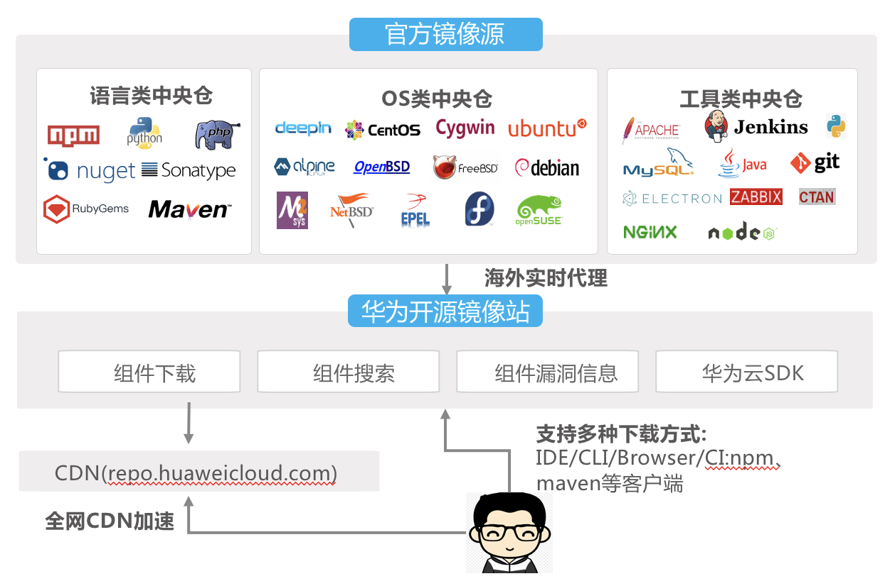

# 华为开源镜像站（Mirrors）

华为开源镜像站（Mirrors）是由华为云提供的开源组件、开源操作系统及开源DevOps工具镜像站，致力为用户提供全面、高速、可信的开源组件/OS/工具下载服务。

开源镜像站：安全、高速、全面的三方开源镜像库
华为开源镜像站（Mirrors）是由华为云提供的三方组件仓库
主要提供开源组件、开源操作系统及开源DevOps工具等下载

## 吹的牛

1. 全面的三方镜像及华为专属镜像
    提供110+种类镜像库
    覆盖Maven、NPM、Python、Nuget等7大语言
    覆盖CentOS、Ubuntu等20+开源OS镜像源
    提供华为鲲鹏、鸿蒙、昇腾、欧拉等生态专属镜像
1. 高速、稳定的下载服务
    全站CDN加速
    提供1500M独立带宽出口
    部署海外镜像源实时代理
1. 自动化辅助缺陷修复
    提国内唯一的Maven central官方镜像库
    Centos、EPEL等官方认证的操作系统镜像源
    提供组件漏洞信息查询

## 参考资料

> [华为开源镜像站文档](https://support.huaweicloud.com/mirrors/)
[华为开源镜像站服务](https://mirrors.huaweicloud.com/)