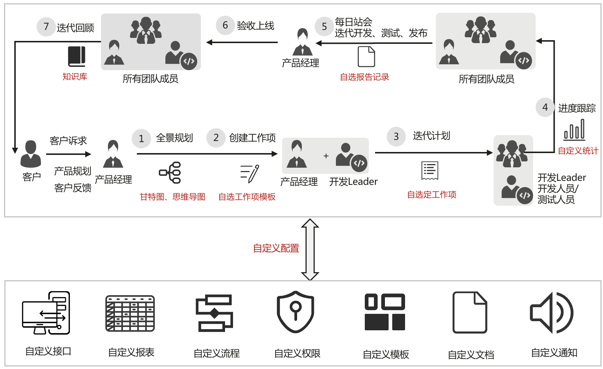
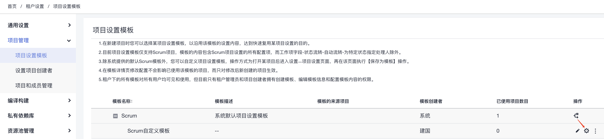
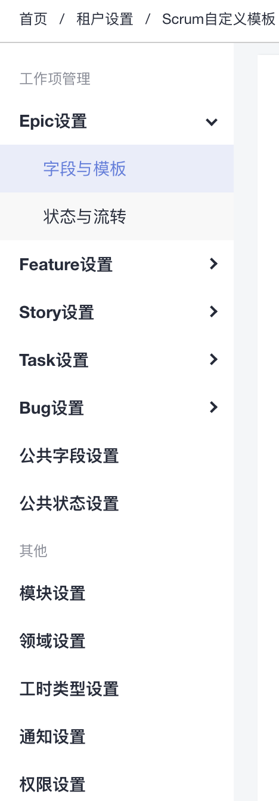

# 项目管理（ProjectMan）

项目管理（ProjectMan）以华为沉淀30多年软件研发的先进理念与丰富实践为基础，为研发团队提供简单高效的团队协作服务，包含多项目管理、敏捷Scrum、精益看板、需求规划和管理、迭代计划管理、缺陷跟踪、自定义工作流、进度跟踪、统计报表/仪表盘/管理看板、Wiki在线协作、项目文档托管等多种软件项目管理的基础特性，支持端到端的高效、透明、可视的管理。

## 吹的牛

1. 科学的敏捷管理、
    专业的敏捷管理：标准的Scrum、精益看板流程模型
    全景规划：甘特图、思维导图，产品全景规划
    最佳实践，开箱即用：预置最佳实践的12+仪表盘，研发作业流，模板
    可视化数据驱动的管理：多项目管理看板，仪表盘，报表
    研发知识管理：结构化知识，沉淀创新。
    可信审计日志：1000+审计事件，全面溯源，安全可靠
2. 丰富的自定义扩展
    自定义统计分析：可通过数十个原子指标自由组合多种维度统计报表
    自定义工作流：自定义工作流的节点、状态、处理人
    自定义角色与权限：数百种原子权限自由组合
    自定义工作项模板：自定义工作项类型模板
    可扩展的API接口生态：100+原子接口，可以自由组合，并集成到第三方系统
    自定义通知：邮件、站内信等多种通知渠道，可自由定义通知人及通知内容

## 关键特性

| 类别 | 特性 |
| --- | --- | --- |
| 敏捷项目管理 | 支持面向专业敏捷的Scrum项目类型和面向轻量级自定义的看板项目类型 |
| 需求规划和管理  |  |
| 迭代计划管理 |  |
| 缺陷跟踪 |  |
| 自定义工作流 |  |
| 进度跟踪 |  |
| 统计报表 |  |
| 仪表盘 |  |
| 管理看板 |  |
| Wiki在线协作 |  |
| 项目文档托管 |  |
| 工作项视图  | 支持列表、层级、卡片形式展示，卡片视图下支持拖动式交互 |

## 自定义功能

1. [自定义项目模板](#自定义项目模板)

## 使用场景

Scrum项目：秉承严谨的敏捷Scrum方法论和实践，适用于敏捷软件开发团队。
看板项目：采用卡片式的交互，适用于轻量、简单管理的软件开发团队。

## 特性实践

### 自定义项目模板

租户设置/项目管理/[项目设置模板](https://devcloud.huaweicloud.com/projectman/templateManagement)

1. 继承项目模板

1. 配置模板

