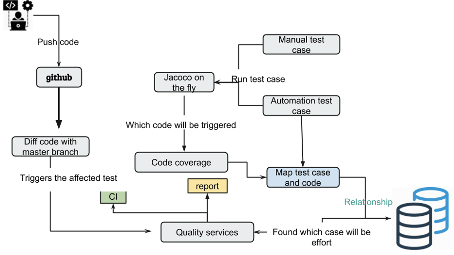
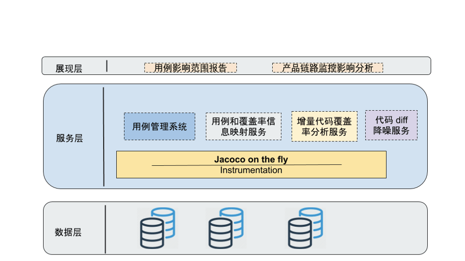

# 精准软件测试

[精准软件测试 - Thoughtworks洞见](https://insights.thoughtworks.cn/accurate-testing/)

定义：利用技术手段对测试过程产生的数据进行采集存储，计算，汇总，可视化最终帮助团队提升软件测试的效率、并对项目整体质量进行改进和优化的这一系列操作。
通俗点讲：核心基于源代码变更分析，结合分析算法，确定影响范围，提升测试效率。
精准测试并没有改变传统的软件测试方法论，只不过是帮助我们将测试用例与程序代码之间的逻辑映射关系建立起来， 而这个过程则是通过算法和工具去采集测试过程执行的代码逻辑及测试数据，在测试过程加入采集过程，形成正向和逆向的追溯。

正向追溯，开发人员可以看到QA执行用例的代码细节，例如用例执行过程中，调用具体方法与实现类，方便进行缺陷的修复与定位。
逆向追溯，测试人员通过release前的增量代码快速确定测试用例的范围，极大减少回归测试的盲目性和工作量，提升ROI，达到测试覆盖率最大化。

这套精准测试架构既可以用作手工测试，也可用在任意自动化测试上。

整个架构分为以下几部分：
    - 建立用例与代码覆盖率之间的映射关系
    - 影响面评估，分析识别增量与变更代码
    - 测试范围评估，用例筛选，链路分析

## 总结精准测试的优点

这种代码与用例，业务之间的关联关系，能够加深我们对被测系统及架构的了解，在不断的版本迭代过程中，能够实时了解任何类型测试对于当前版本的覆盖率，是否有遗漏的场景等，帮助团队更好的建立信心，使质量真正走上可持续化道路。
精准测试在项目的中后期不在不依赖个人能力以及业务熟悉度等特点，大幅降低了团队测试的成本，使得团队QA能够有大量的时间做探索性测试以及质量度量上，提高QA对于团队的ROI，带给团队更清晰的质量数据。
但事物总是存在对立面的，获得巨大的收益同时，必然相应的存在缺点。否则也应当像UI自动化测试一样流行于各个公司以及团队中。

## 精准测试存在的问题

基于手工测试的精准测试建立映射关系繁杂，如果需求改变频繁，用例维护以及之间的关系维护需要耗费大量时间精力。
精准测试需要一定的自动化测试的覆盖，这样做起来更有意义，例如api自动化测试，如果本身用例过少，与代码之间关联关系不多时，变更代码后可能不会得出什么结果。
最好有对应的用例管理系统，能够方便的帮助我们建立与代码之间的关系。
需要投入开发能力强的QA或者测试开发建立整套系统环境，但长远考虑，将精准测试嵌入整个公司的质量平台中，不管对于新项目还说维护项目来说都是一种提升。
项目生命周期需要较长，短期项目花费巨大精力开发和维护整套精准测试系统得不偿失。短期项目可以利用精准测试以api测试覆盖率作为衡量标准。不去建立繁杂的关系，只监控UI API测试覆盖率迭代时的变更来达到目的。

精准测试不是银弹，需要巨大的投入，用的好，能够成倍的提升质量，生产效率，用不好的话，就成了领导的KPI项目，弃之可惜，食之无味，鸡肋也。
