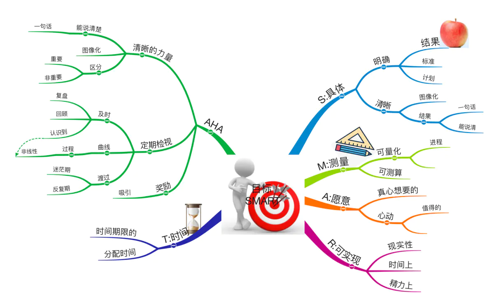

# SMART原则

目标设定的SMART原则来源于管理大师彼得·德鲁克的《管理的实践》，有五个基本的原则：

1.目标必须是具体的（Specific）
2.目标必须是可以衡量的（Measurable）
3.目标必须是可以达到的（Attainable）
4.目标必须和其他目标具在相关性（Relevant）
5.目标必须具在明确的截止期限（Time-based）

以上五个原则是常用在工作者和管理者之间，对于个人成长之类的目标，是自己单方的目标，使用以上原则还有可以优化的地方，目的只有一个，如何设定高达成度的目标。以下对五个原则做一个补充。

1.具体（Specific）。目标一定要明确，一次只能聚集一个目标，如果目标太大，就要把目标分解一个个小目标，并且是清晰的，要有明确的结果。目标清晰就是尽将结果图像化，在达到的目标能用一句话说清楚。目标有标准去衡量，还要有实现目标的计划。

2.可测量（Measurable）。可测量就是目标是否达成可以用指标或成果的形式进行衡量。在目标实现的过程中，目标的进度最好也是可以衡量的，至少有几个关键事件点来表示目标的实现的进度。在实现目标的过程中，对于完成目标的一些事务或关键事务是可以量化的。

3.我愿意的（Agreed on）。目标是自己的意愿，是自己真正想去实现的，是值得自己努力获取的。

4.可实现的（Realistic）。目标是基于自身的条件的，千万不可脱离太多的既有条件，有时，远大的目标会让人在实现目标的过程中迷茫和焦虑，如何有比较远大的目标，一定要把目标分解成多个小目标。可实现还包括要分配一定的时间和精力，光制订目标，然后不能安排时间和精力或其他必要的资源，目标也是不现实的。

5.时间限制的（Time-based）。目标一定要有时间限制，否则，时间一长，新鲜感一过，目标就很难再继续下去了。

实现目标需要很多条件，除了以上几个原则外，还有以下几条需要注意：

1.清晰的力量。能够一句话说清晰自己的目标，并且尽量把所要的结果图像化，能够帮助我们在实现目标的过程中区分一些事务对目标的影响，哪些是重要的？哪些是不重要的。

2.定期检视。定期检视自己要实现的目标与当前的进度计划，及时的对实现目标过程中所做的事务的复盘，找到做的好的地方和做的不好的地方。要认识到实现目标的过程不是线性接近目标的，是曲线波折的，在低谷时，也不要灰心，这有助于帮助我们渡过迷茫期。

3.奖励。一定要对自己实现目标后，设定一个奖励。
