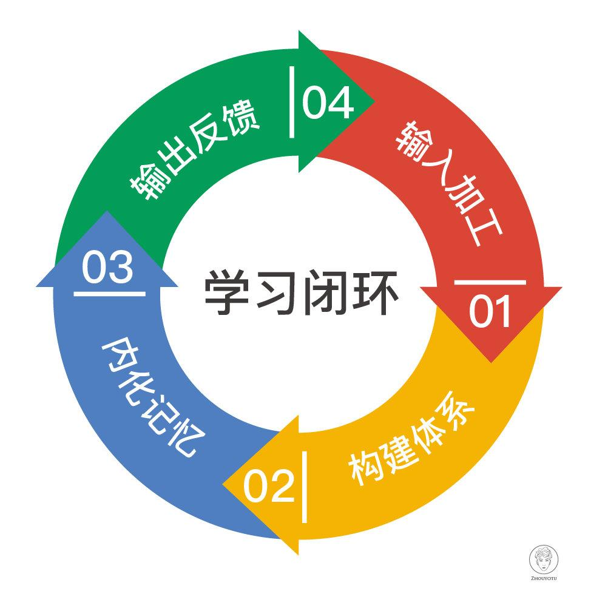
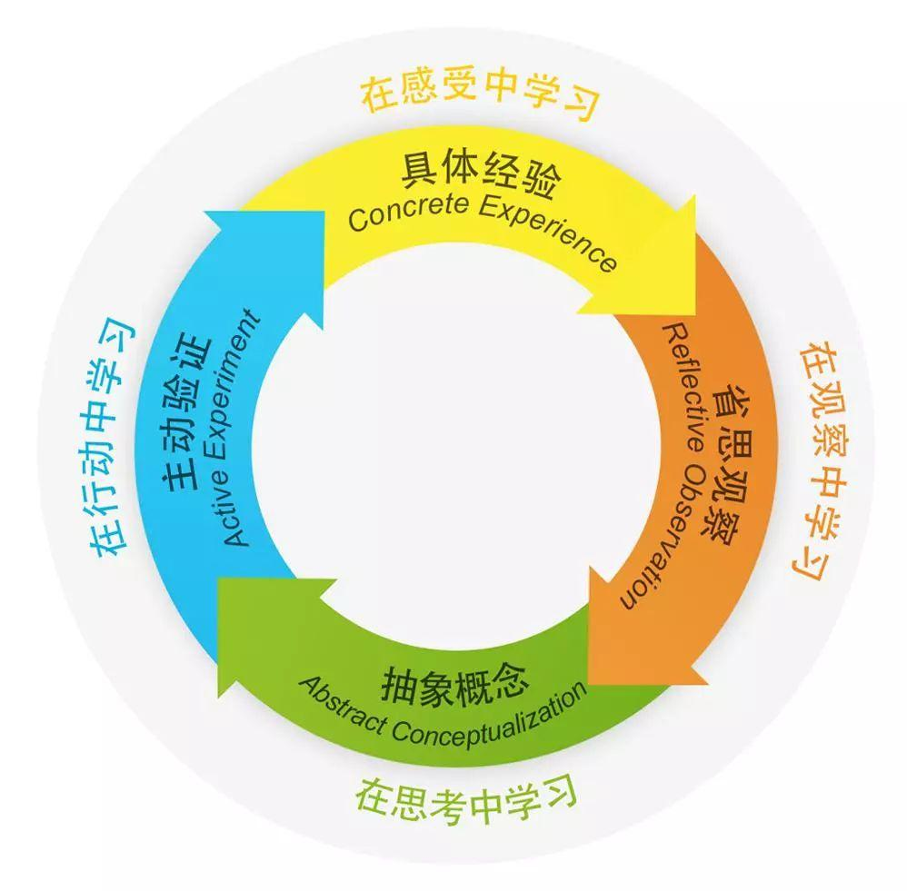
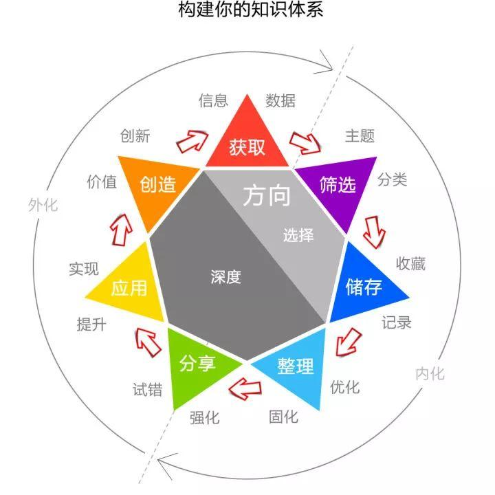
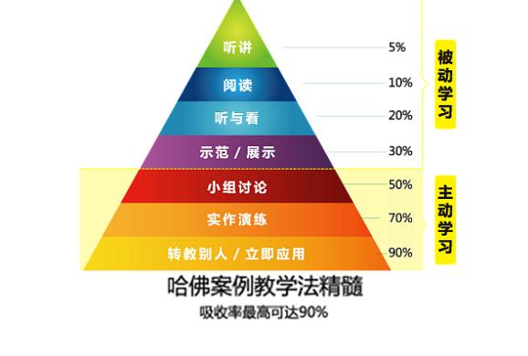

# 内化

“要认真学习……，做到内化于心，外化于行”。
由领悟到应用的转化过程!

内化（Internalization）

- 其意为掌握，学以致用；
- 变成你自己的知识和能力；
- 学习了知识，然后对知识进行分类、编辑或者加工，放在你的大脑里面这个过程。
- 要让知识在我们大脑里面留下痕迹，留下痕迹的过程其实就是“内化”；
- 就是要把学习到的理论与个人的历史实践行为、经验教训进行充分的结合融合，去糟粕、取精华，吸收固化成为自己的学习所得，深深记在脑中和心底，以便为今后的实践活动，提供及时的指导；
- 就是把别人的态度和认知，整合到自己的三观里。
- 学习界的“内化”，是把新的知识纳入到你的知识体系中。

