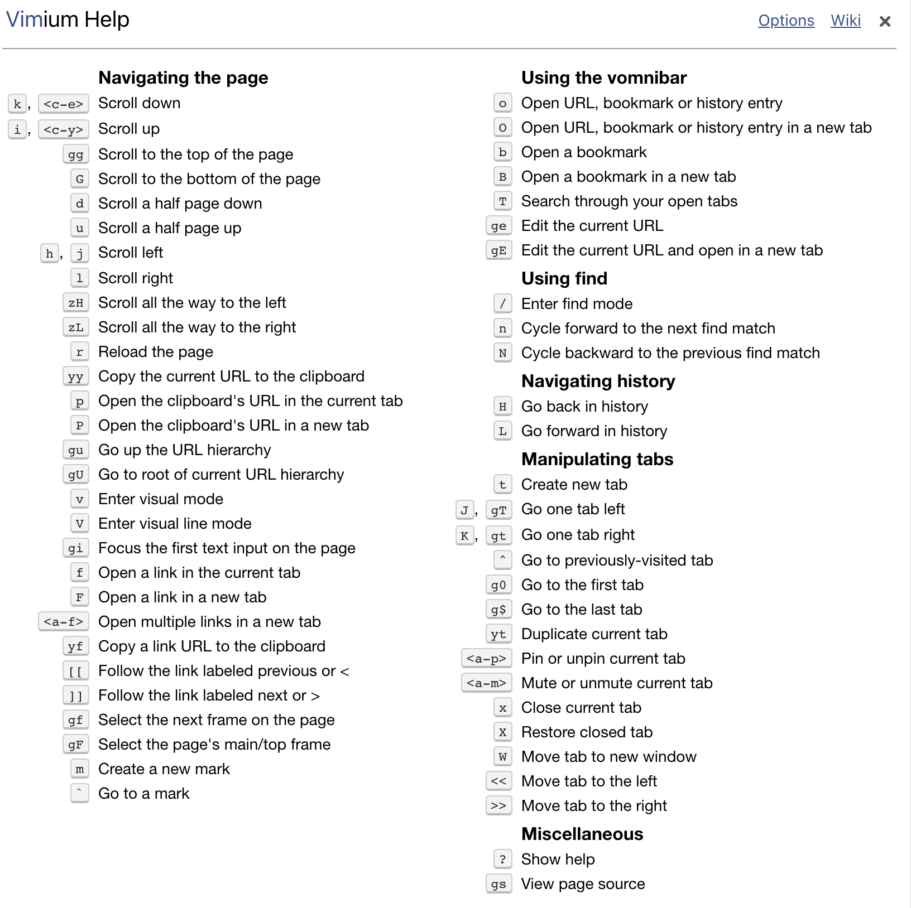

# Web浏览器

## Chrome

### Chrome插件

1. Vimium
    常用快捷键：?(查看快捷键)
    
2. AdGuard 广告拦截器
3. Nimbus 截幕 & 屏幕录像机
4. Infinity 新标签页 (Pro)
5. Imagus
6. Octotree - GitHub code tree
7. Tampermonkey

### Q&A

1. 不信任的证书，页面无法打开。
   解决方法：鼠标点击空白处，键盘输入thisisunsafe
